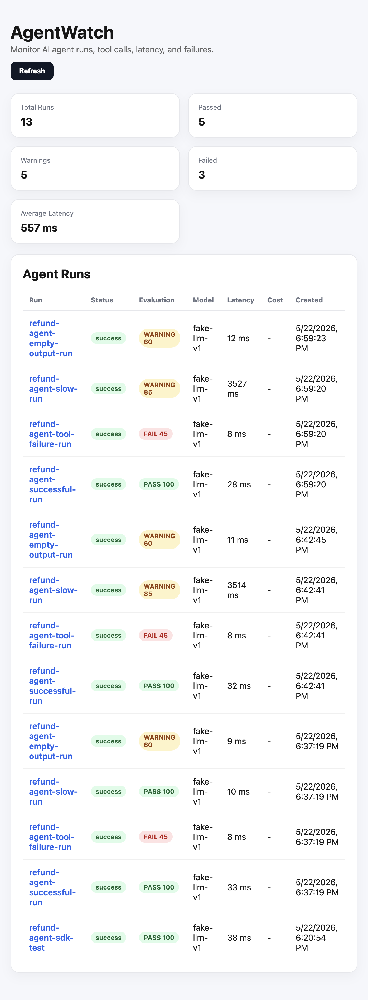
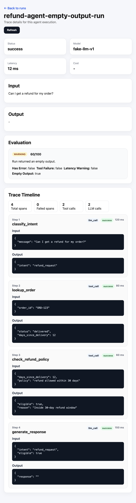

# AgentWatch

## Overview

AgentWatch is a lightweight observability dashboard for AI agents that helps developers trace runs, inspect tool calls, detect failures, measure latency, and evaluate execution quality.

## Why AgentWatch?

AgentWatch provides a compact end-to-end experience for building, testing, and reviewing agent workflows. It combines a FastAPI backend, Python SDK, React dashboard, and demo scenarios so teams can quickly demonstrate AI traceability and runtime quality checks.

## Features

- Python SDK for instrumenting agent workflows
- FastAPI backend for collecting runs and spans
- SQLite database with SQLAlchemy models
- React + Vite dashboard
- Run list with status, latency, and latest evaluation
- Run detail page with input, output, spans, and evaluation
- Span-level failure highlighting
- Rule-based pass / warning / fail evaluations
- Demo refund agent with success, slow, tool-failure, and empty-output scenarios

## Screenshots

### Runs Dashboard



### Run Detail



## Tech Stack

- Backend: FastAPI
- Database: SQLite, SQLAlchemy
- Frontend: React, Vite
- SDK: Python
- HTTP client: `requests`

## Project Structure

AgentWatch/
  backend/
    app/
      main.py
      database.py
      models.py
      schemas.py
      routes/
        projects.py
        runs.py
        spans.py
      services/
        evaluator.py
    requirements.txt
  frontend/
    src/
      App.jsx
      App.css
      index.css
      main.jsx
      pages/
        RunDetailPage.jsx
        RunsPage.jsx
    api/
    components/
      SpanCard.jsx
    public/
    package.json
    vite.config.js
  sdk/
    agentwatch/
      __init__.py
      client.py
      tracing.py
  examples/
    refund_agent/
      demo.py
  screenshots/
    runs-list.png
    run-detail.png
  LICENSE
  README.md

## Quick Start

### 1. Start Backend

```bash
cd backend
python -m venv venv
source venv/bin/activate
pip install -r requirements.txt
uvicorn app.main:app --reload
```

Backend URL: `http://127.0.0.1:8000`

Swagger docs: `http://127.0.0.1:8000/docs`

### 2. Start Frontend

```bash
cd frontend
npm install
npm run dev
```

Frontend URL: `http://localhost:5173`

### 3. Install SDK Locally

```bash
cd sdk
pip install -e .
```

### 4. Create a Project

```bash
curl -X POST http://127.0.0.1:8000/projects/ \
  -H "Content-Type: application/json" \
  -d '{"name":"refund-agent"}'
```

### 5. Run Demo Agent

From the repository root:

```bash
python examples/refund_agent/demo.py
```

This generates four demo runs:

- successful run
- slow run
- tool failure run
- empty output run

## SDK Example

```python
from agentwatch import AgentWatch

aw = AgentWatch(
    api_key="demo-key",
    project_id=1,
    base_url="http://127.0.0.1:8000"
)

with aw.trace(
    run_name="refund-agent-test",
    input_text="Can I get a refund?",
    model="fake-llm-v1"
) as run:
    run.log_span(
        span_type="llm_call",
        name="classify_intent",
        input_data={"message": "Can I get a refund?"},
        output_data={"intent": "refund_request"},
        latency_ms=120
    )

    run.log_span(
        span_type="tool_call",
        name="lookup_order",
        input_data={"order_id": "ORD-123"},
        output_data={"status": "delivered"},
        latency_ms=80
    )

    run.set_output("The customer may be eligible for a refund.")
```

## Evaluation Logic

AgentWatch uses a rule-based evaluator for completed runs. Each run starts with a score of 100, and penalties are applied for issues detected during execution:

- Span error: -30
- Tool failure: -25
- Latency warning: -15
- Empty output: -40

Evaluation labels are assigned as:

- `pass`
- `warning`
- `fail`

Current evaluator checks include:

- `has_error`
- `tool_failure`
- `latency_warning`
- `empty_output`

## API Examples

```bash
curl http://127.0.0.1:8000/projects/
```

```bash
curl http://127.0.0.1:8000/runs/
```

```bash
curl http://127.0.0.1:8000/runs/1
```

## Roadmap

- API key validation
- Docker Compose setup
- PostgreSQL support
- LangChain / LangGraph integration
- LLM-as-judge evaluations
- Prompt/version tracking
- Export traces to JSON/CSV
- Hosted deployment

## License

License details are available in the LICENSE file.

<!--
Recommended GitHub About:
Description: Lightweight monitoring and evaluation dashboard for AI agents.
Topics: ai-agents, llm, observability, fastapi, react, python-sdk, agent-monitoring, developer-tools
-->
